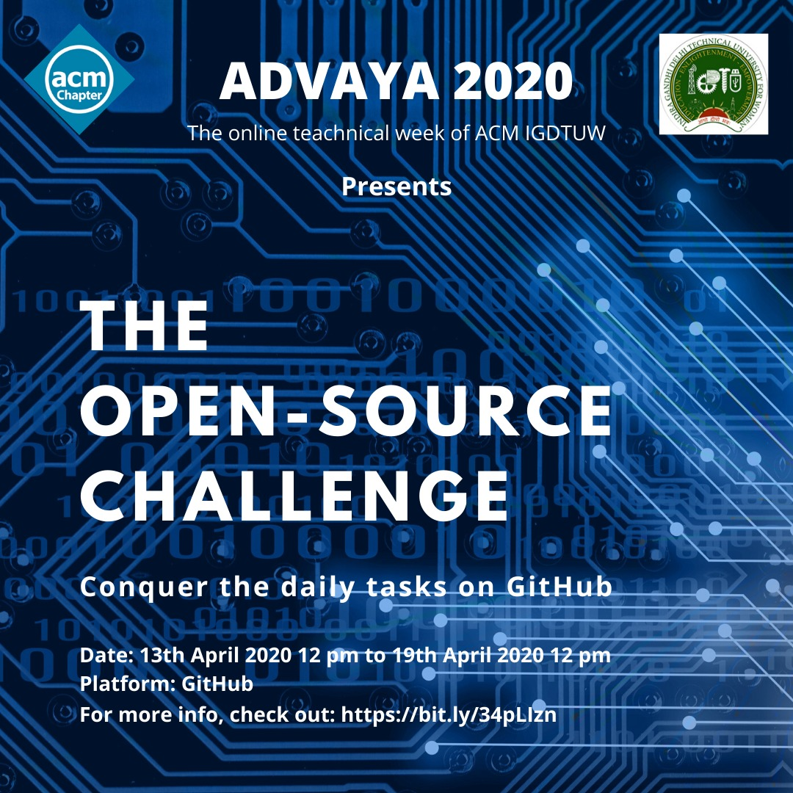

# The Open-Source-Challenge 

Advaya'20 brings to you The Open Source Challenge. This will be a series of tasks provided to the participants to help them learn more about the ways of Open Source! Each task will have allotted points which will be awarded to all the participants that successfully complete the task. Everyday a new task will be added. The participant with the highest points by the end of the Advaya'20 Tech Week will be the winner and will earn certificates and exciting prizes. 

For any queries, please feel free open an issue in this repository and we will get back to you soon!

## Participation

This contest will contain several issues that will come with some allotted points. Each day at 12 pm an issue will be published that will contain a detailed explanation of the task and the guidlines to solve it. To look through the tasks that are given, please look through the issues in this repository that have an `Open Source Challenge` label. Once you solve an issue as guided in the task description, points will be allotted to you out of 8 on the basis of how well you adhere to the guidlines of the task.

For participating in this contest, register [here](https://bit.ly/3c3lNQY) and go through the [Contribution guidelines](https://github.com/ACM-IGDTUW/Open-Source-Challenge/blob/master/CONTRIBUTION.md) in order to get a gist of how to work in an open source project.

## Rules

-   Each task will be given 24 hours to complete. 
    
-   Any submission after the deadline of the task, that will be 12 pm of the next day from the day the task was published, will result in the decrement of the score by 1.

-   For tasks that involve no coding, all the solutions must be posted in the comment section of that issue. 

-   No questions or doubts should be asked in the comment section of a task issue, i.e. an issue which has the label `Open Source Challenge`.
    
-   To ask for help, feel free to open a new issue in this repository.

*Happy Contributing!*

_____________________________________________________________________________________

.png)
